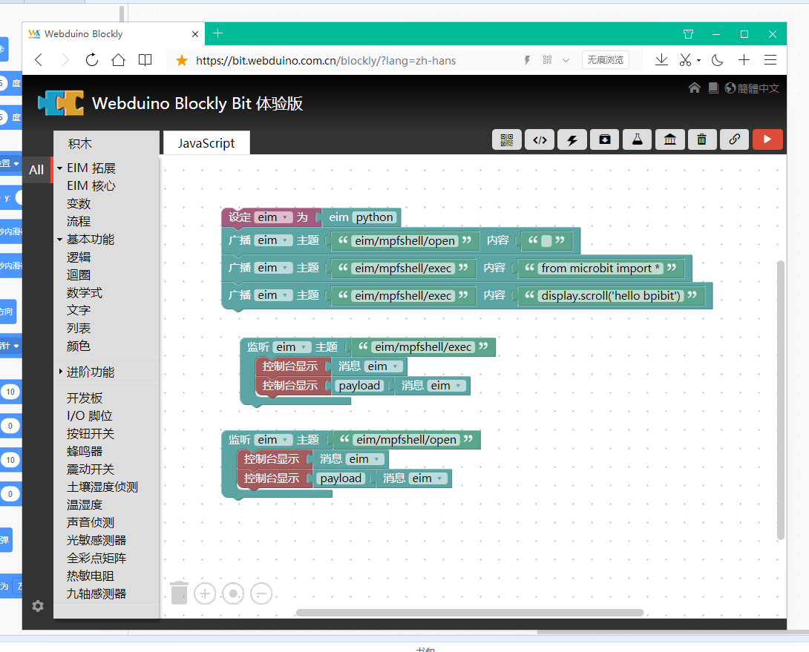
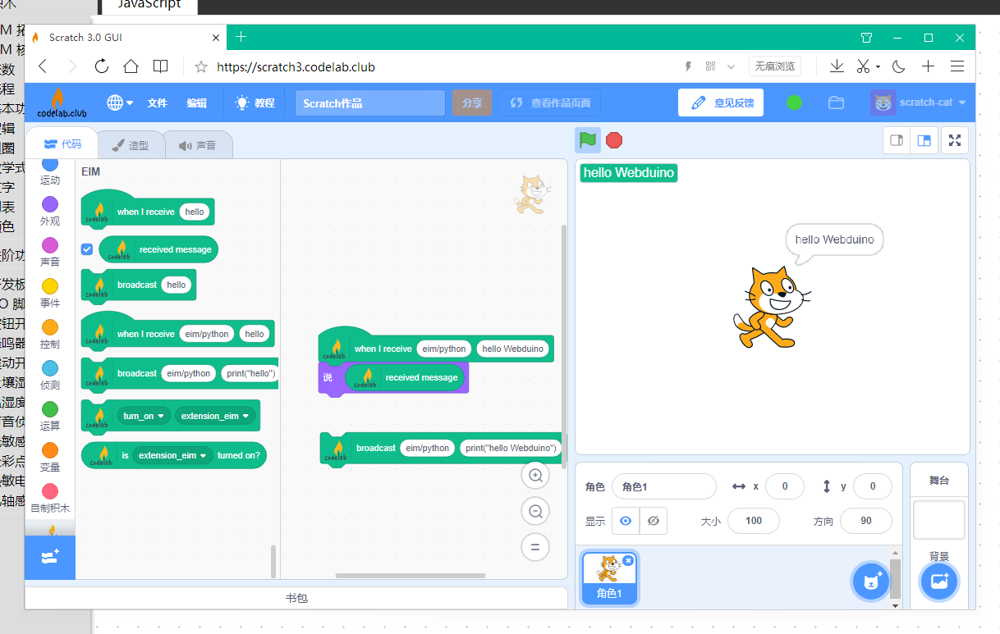
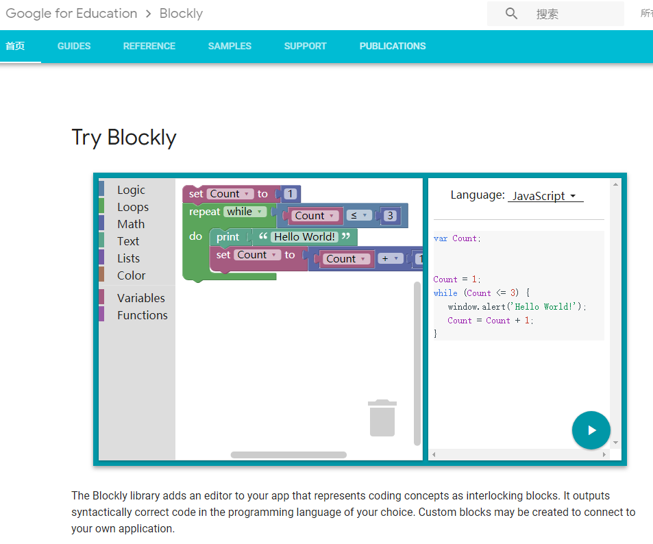
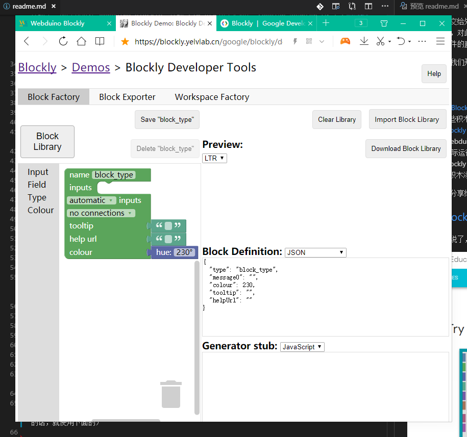

# Webduino Blockly 之 EIM 拓展的设计与实现

## 前言

本文是为以下两个软件体系联系在一起所做。

[webduino blockly](https://bit.webduino.com.cn/blockly)

[codelab scratch3](https://scratch3.codelab.club/)

介绍一下两者的特色。

1. webduino 以 JavaScript 为核心。

   在 Web 的世界中做了大量的物联网应用，核心模块有 webduino-js、webduino-blockly，前者解决了 JavaScript 到 HardWare 的通信控制问题，而后者则是以谷歌的 Blockly 为基础创建了积木块（隐含代码），并通过 JavaScript 语言来运行代码，此外官方所做的硬件产品是基于esp系列物联网芯片所做。

2. codelab 以 Python 为核心。

   通过一个跨平台的软件，将许多功能透过 Python 代码接入 scratch3 的插件系统，并且有望进入 scratch3 的社区形成核心插件系统，由于有了 Python 的加持，这会让 scratch3 在额外功能上拓展出无限可能，不仅如此，目前还可以应用在 Blockly 中，也是本文所开发的产物，因为这只需要完成对 EIM 的基本接入即可。

与其说去比较哪个更好用，不如把两个整合到一起吧，你觉得呢？

接下来以此文为例，我将讲述以下两个重点。

第一，能够指导他人开发出属于自己的积木块动态载入到 Webduino Blockly 中，分享并推广自己的作品，又或是制作自己的硬件积木版型，促进更多开发者参与积木的设计与开发当中，使得众人对 Blockly 不再陌生，对积木开发不再恐惧，通过我提供的积木代码，你可以基于它的设计与思考，对照实现属于自己的积木模块，创建自己的积木不需要部署服务器（除非你真的需要，因为它是开源的），并且你可以随时导入属于自己的外部 JavaScript 代码，因此你将拥有一个可以自定义的积木网站（尽量忽略掉那些网站自带的那些不太重要的积木块吧XD）。另外，积木块的多语言也不是问题哟（至少现在允许中文、繁体、英文的定义与切换）。

第二，对于 JavaScript 中不容易实现的硬件控制功能，我认为，是时候借助 Python 的力量来实现了，所以我将在 Webduino Blockly  实现 EIM 积木块来提供给 codelab-adapter (0.7.1+) 服务软件，此时你就可以将把原本 JavaScript 做不到的事情交给外部程序来做，进行多程序的互动，例如，同时使用 Webduino 和 scratch3 的网站程序一同协助并不是不行喔，对此我也提供了 mpfshell 插件供 Webduino 或 scratch3 等积木块来与 MicroPython 硬件进行通信，从而实现对硬件的直接编程。

长话短说，让我们开始吧。

## 目录

1. 什么是 [Blockly](https://developers.google.cn/blockly/)
2. 了解一些积木的开发
3. 认识  [Blockly 积木开发工具](https://blockly.yelvlab.cn/google/blockly/demos/blockfactory/index.html)
4. 导入 Webduino Blockly 运行环境
5. 编写 实际运行的 JavaScript 代码
6. 准备 Blockly 积木生产的代码
7. 最后给积木添加多语言变量

把你的作品，分享给你的朋友吧

## 什么是 [Blockly](https://developers.google.cn/blockly/)

复杂的我就不说了，简单来说吧，看下图。

可以看到它将积木转变成了代码，如果你想要体验的话，可以访问 [google blockly](https://developers.google.com/blockly/) 来体验一下，此时你应该知道 Blockly 就是指 谷歌开发的一种 积木 生成 代码的工具。

但这只是表面的东西，我们作为开发者，需要知道的是积木的开发方式，也就是下一节

## 了解一些积木的开发

一切从简，直接来这里。

1. 国外源[Blockly Developer Tools](https://blockly-demo.appspot.com/static/demos/blockfactory/index.html)

2. 国内源[Blockly Developer Tools](https://blockly.yelvlab.cn/google/blockly/demos/blockfactory/index.html?tdsourcetag=s_pctim_aiomsg) （如果你访问不了上面那个的话，就使用下面的）

直接看实例，挑几个基本的来讲。

点击 Import Block Library 选择 [library.xml](https://junhuanchen.github.io/webduino-module-eim/library.xml) （需要下载出来）