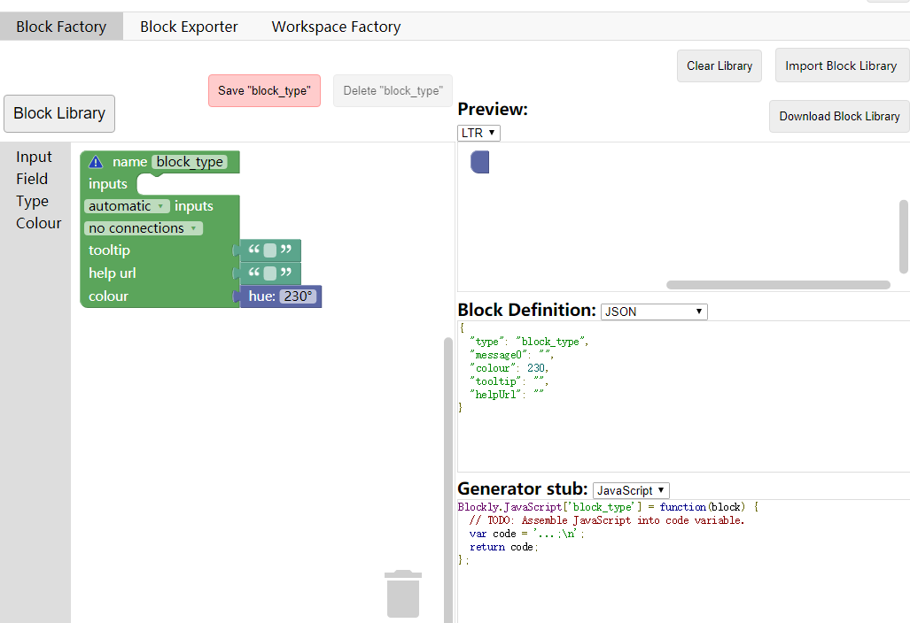

# Webduino Blockly 之 EIM 拓展的设计与实现

本插件地址：`https://junhuanchen.github.io/webduino-module-eim/blockly.json`

## 前言

本文是为以下两个软件体系联系在一起所做，阅读者需要 Nodejs 和 JavaScript 的前置技能，包括对 Blockly 的基本使用常识，如果没有一丁点的资料查阅能力，就没必要看这篇文章了，本文不适合没有学习能力的开发者。

[webduino blockly](https://bit.webduino.com.cn/blockly)


[codelab scratch3](https://scratch3.codelab.club/)


介绍一下两者的特色。

1. webduino 以 JavaScript 为核心。

   在 Web 的世界中做了大量的物联网应用，核心模块有 webduino-js、webduino-blockly，前者解决了 JavaScript 到 HardWare 的通信控制问题，而后者则是以谷歌的 Blockly 为基础创建了积木块（隐含代码），并通过 JavaScript 语言来运行代码，此外官方所做的硬件产品是基于esp系列物联网芯片所做。

2. codelab 以 Python 为核心。

   通过一个跨平台的软件，将许多功能透过 Python 代码接入 scratch3 的插件系统，并且有望进入 scratch3 的社区形成核心插件系统，由于有了 Python 的加持，这会让 scratch3 在额外功能上拓展出无限可能，不仅如此，目前还可以应用在 Blockly 中，也是本文所开发的产物，因为这只需要完成对 EIM 的基本接入即可。

与其说去比较哪个更好用，不如把两个整合到一起吧，你觉得呢？

接下来以此文为例，我将讲述以下两个重点。

第一，能够指导他人开发出属于自己的积木块动态载入到 Webduino Blockly 中，分享并推广自己的作品，又或是制作自己的硬件积木版型，促进更多开发者参与积木的设计与开发当中，使得众人对 Blockly 不再陌生，对积木开发不再恐惧，通过我提供的积木代码，你可以基于它的设计与思考，对照实现属于自己的积木模块，创建自己的积木不需要部署服务器（除非你真的需要，因为它是开源的），并且你可以随时导入属于自己的外部 JavaScript 代码，因此你将拥有一个可以自定义的积木网站（尽量忽略掉那些网站自带的那些不太重要的积木块吧XD）。另外，积木块的多语言也不是问题哟（至少现在允许中文、繁体、英文的定义与切换）。

第二，对于 JavaScript 中不容易实现的硬件控制功能，我认为，是时候借助 Python 的力量来实现了，所以我将在 Webduino Blockly  实现 EIM 积木块来提供给 codelab-adapter (0.7.1+) 服务软件，此时你就可以将把原本 JavaScript 做不到的事情交给外部程序来做，进行多程序的互动，例如，同时使用 Webduino 和 scratch3 的网站程序一同协助并不是不行喔，对此我也提供了 mpfshell 插件供 Webduino 或 scratch3 等积木块来与 MicroPython 硬件进行通信，从而实现对硬件的直接编程。

长话短说，让我们开始吧。

## 什么是 [Blockly](https://developers.google.cn/blockly/) ？

复杂的我就不说了，简单来说吧，看下图。


可以看到它将积木转变成了代码，如果你想要体验的话，可以访问 [google blockly](https://developers.google.com/blockly/) 来体验一下，此时你应该知道 Blockly 就是指 谷歌开发的一种 积木 生成 代码的工具。

但这只是表面的东西，我们作为开发者，需要知道的是积木的开发方式，也就是下一节

## 认识 Blockly 积木

一切从简，直接来这里。

1. 国外源 [Blockly Developer Tools](https://blockly-demo.appspot.com/static/demos/blockfactory/index.html)

2. 国内源 [Blockly Developer Tools](http://walkline.wang/blockly/blockfactory/
) （如果你访问不了上面那个的话，就使用这个，如果还不行，再用这个[备用](https://blockly.yelvlab.cn/google/blockly/demos/blockfactory/index.html?tdsourcetag=s_pctim_aiomsg)）



进入网站以后，点击右上角的 [Import Block Library] 选择 [demos/library.xml](https://github.com/junhuanchen/webduino-module-eim/blob/master/demos/library.xml) （需将该文件保存到本地后选取导入）

载入 `library.xml` 后点击 [Block Library] 此时会看到有我设计的一些积木。


所以我们直接看实例，专挑几个常用的基本积木来讲。

如图中所示，下拉选择 eim_info 积木确认后，将载入该积木。（不管任何提示，确定就对了）


现在就是准备好积木的开发环境了，具体的用法我也且先不谈，因为你可以去看其他人写好的关于这方面的资料，下面是一些我看过的 Blockly 开发的基本操作说明。

1. [Blockly 创建自定义块-概述](https://itbilu.com/other/relate/H1huYbEWQ.html)
2. [Blockly 创建自定义块-Blockly 开发者工具](https://itbilu.com/other/relate/r1IhFZV-X.html)

更详细和可靠的内容，你需要看 [google blockly](https://developers.google.com/blockly/) 的标准开发文档。

## 开发 Blockly 积木

基于上节可以知道积木是通过上述网站得到的，所以现在来试着开发它们。

比如说我们载入的这个 `eim_info` 积木。


我们可以在 [Workspace Factory] 中测试它的应用方式，你也可以在这里对自己的积木进行功能核对。


但开发工具得到的主要就以下两个部分。

1. 积木的样式描述

（注意下拉选择的是 JavaScript，而默认是显示 JSON）


这些代码的功能用途是对 积木的外观做一个定义，所以这就是积木的外观代码。

```javascript
Blockly.Blocks['eim_info'] = {
  init: function() {
    this.appendDummyInput()
        .appendField("every is message!");
    this.setOutput(true, null);
    this.setColour(180);
 this.setTooltip("");
 this.setHelpUrl("");
  }
};
```

虽然有设计器了，但还是要简单解释一下这些函数的基本功能。

- appendDummyInput 给这个积木添加一个没有参数的输入接口。
- appendField  给这个积木的输入接口添加一个文本参数，仅做为积木的文本显示用。
- setOutput 给积木准备一个输出，如果没有它就没有办法 被 其他积木给结合了。
- setColour 设置积木的颜色。
- setTooltip 设置积木的自动提示，当用户不知道这个积木的详细用途的时候，可以在这里进行补充说明。
- setHelpUrl 设置跳转的辅助文档网站，如果需要可以链接到其他地方来进行文档的说明。

更多的说明你需要看这个 [define-blocks](https://developers.google.cn/blockly/guides/create-custom-blocks/define-blocks) ，就可以知道所有积木的设计规则。

2. 积木的生成函数

积木的外观设计完成后就到积木生成的代码了，这个地方我只做 JavaScript 的示范，其他的不属于 Webduino-Blockly 需要考虑的范围。


可以看到如下代码，注意 `var code = '...'` ，这里的变量就是要生成的代码，所以在这里，得到的就是 ... 代码。

```javascript
Blockly.JavaScript['eim_info'] = function(block) {
  // TODO: Assemble JavaScript into code variable.
  var code = '...';
  // TODO: Change ORDER_NONE to the correct strength.
  return [code, Blockly.JavaScript.ORDER_NONE];
};
```

举个例子，就可以变成这样。

```javascript
Blockly.JavaScript['eim_info'] = function(block) {
  // TODO: Assemble JavaScript into code variable.
  var code = 'console.log("eim_info")';
  // TODO: Change ORDER_NONE to the correct strength.
  return [code, Blockly.JavaScript.ORDER_NONE];
};
```

这样在拖动积木的时候就会出现 `console.log("eim_info")` 了，实际的使用方式将在下面应用的时候涉及到。

但至少你现在知道了 Blockly 的开发工具仅仅是为了上述两件事。

## 应用 Blockly 积木

现在我将进入真正意义上的 Webduino-Blockly 开发，在开始应用积木到 Webduino 网站之前，我们先对积木插件的结构有一个大概的认识。

如下图，也就是本积木模块的 github 项目，它就相当于一个基本的积木开发框架了。


注意到红圈就可以了，我会依次按顺序展开说明的，因为我踩了很多坑，所以我会重新调整开发顺序，让后来人少走弯路。

总共有如下几块步骤，依次掌握以后，你就学会了。

1. 导入写好的积木项目到网站中，并看到运行效果。

2. 忽略细节，基于可用的积木项目进行修改后提交。

3. 在 Webduino Blockly 里提供的 JS bin 进行代码的功能测试。

### 第一步，学会导入积木到 Webduino-Blockly

先来一个直观的感受吧，进入 [Webduino Blockly](https://bit.webduino.com.cn/blockly ) 网站，直接点左下角的菜单项目。


然后直接导入本项目进去，注意链接是 `https://junhuanchen.github.io/webduino-module-eim/blockly.json` ，如图所示。


这样你就完成了积木的导入，如下图。


#### 在 Github 中得到自定义积木的链接

如何得到这个 `https://junhuanchen.github.io/webduino-module-eim/blockly.json` 链接，在此我也会做一个示范，比如你把本项目 Fork 了，但此时你还是无法按我上述所给的网址进行你的插件链接的，还需要按下图的方式去设置你 Frok 项目就可以了。

1. 进入 fork 项目的 Settings.


2. 下拉到 GitHub Pages 并点击 Choose a theme 按钮。


3. 不管发生了什么，直接选 Select theme 就对了。


4. 此时会跳转回来，这时候你再看到它，就会发现有下图的效果了。


这时候你就可以使用 `https://bpi-steam.github.io/webduino-module-eim/blockly.json`的链接导入到 Webduino-Blockly 中了，让我们来试试吧。


好了，现在你已经知道怎么把积木导入网站了吧，所以我们可以愉快的开始我们的开发了，但这个开发要学会分离，不要像我最开始的时候，一边修改代码，一边导入 blockly ，极其的浪费时间。

所以把本文看懂了再动手，可以省下很多时间喔，如果有不懂的地方可以提 issue 给我谢谢哈。

### 第二步，认识 Webduino Blockly 积木结构

Webduino Blockly 保持谷歌的原滋原味，并为它添加了一些物联网的积木，和谷歌稍微有些不一样的地方是，Webduino Blockly 是 Blockly 的 JavaScript 运行环境，也就是说，在 Blockly 的基础上，添加了 Js 代码的运行环境。

如果你有用过其他 Blockly 网站，那它其他 Blockly 网站设计不同的地方在于，你可以不依赖任何网站，也可以积累下自己的 Blockly 积木和代码库，借助本文所说的，你可以不需要部署任何东西，就可以将自己制作的积木作品分享给他人。

先解释一下 [blockly.json](https://github.com/junhuanchen/webduino-module-eim/blob/master/blockly.json) 的文件定义，这里就将指出哪些代码需要导入积木网站中。

```javascript
{
  "types": [ // types 以下都是积木的定义声明，没有在这里添加声明的积木名称将无法使用。
    "eim_broadcast",
    "eim_message",
    "eim_create",
    "eim_listen",
    "eim_info", // 下文我会以此 eim_info 积木 作为基础例子
    "dict_get"
  ],
  "category": "eim", // 这个是一个不重要的列表分离，表示该积木插件所属的列表。
  "scripts": [ // 此处声明的脚本是 定义积木 时所用的脚本依赖，注意它不与 dependencies 的共用
    "stringFormat.js", // 一个简易的字符串 format 库
    "eim-blockly.js", // 提供 blockly 代码生成的接口分离文件（我会细说）
    "blockly/blocks.js", // Blockly 开发工具提供
    "blockly/javascript.js" // Blockly 开发工具提供
  ],
  "dependencies": [ // 此处声明的脚本是 积木生成代码 在运行的时候所需要的依赖项，要注意依赖的先后顺序。
    "stringFormat.js",
    "https://cdn.bootcss.com/socket.io/2.2.0/socket.io.slim.js", // 从外网获取的 js 依赖。
    "eim.js" // eim 内部实现的代码。
  ],
  "msg": "blockly/msg", // 提供全局语言变量的文件夹
  "blocksMsg": "blockly/msg/blocks", // 提供积木自身语言变量的文件夹
  "toolbox": "blockly/toolbox.xml" // 定义提供的积木列表
}
```

现在你只需要粗略看一下上方代码中的提供的注释项，因为这些文档说明我是不会将其写进源代码中的，现在看不懂没关系，之后我都会依次说明，本文将作为标准的官方积木定义说明书提供给大家，所以尽管放心，知无不言，言无不尽。

### 第三步，制作属于你的 Blockly 积木拓展包

先从一个结果开始说起吧，我们先使用它，然后依次说明如何得到它，包含具体实现。


选择它，并拖出来，确认后看它生成的代码，然后来到项目里看对应的代码。


我们可以知道 `console.log(("every is message!"));` 这段代码就是在运行一个控制台输出（F12），如下图所示。


现在你就知道，如何 拖拽积木 和 运行积木 了。

那么这是怎么做到的呢？

记得最开始的积木定义的开发工具吧，如下图。


实际上，你可以在本项目的 [blockly/blocks.js](https://github.com/junhuanchen/webduino-module-eim/blob/a1d9951e146865eeadcf5ed02e03f93b8e0fe408/blockly/blocks.js#L61-L70) 文件里看到它的 Block Definition 的定义，同样也可以在  [blockly/javascript.js](https://github.com/junhuanchen/webduino-module-eim/blob/a1d9951e146865eeadcf5ed02e03f93b8e0fe408/blockly/javascript.js#L36-L41) 看到它的 Generator stub 实现。

我直接拿代码回来，你可能就比较眼熟了。

blockly/blocks.js

```javascript
Blockly.Blocks['eim_info'] = {
  init: function() {
    this.appendDummyInput()
        .appendField(Blockly.Msg.eim_info);
    this.setOutput(true, null);
    this.setColour(180);
 this.setTooltip("");
 this.setHelpUrl("");
  }
};
```

blockly/javascript.js

```javascript
Blockly.JavaScript['eim_info'] = function (block) {
  // TODO: Assemble JavaScript into code variable.
  var code = '"{0}"'.format(Blockly.Msg.eim_info);
  // TODO: Change ORDER_NONE to the correct strength.
  return [code, Blockly.JavaScript.ORDER_NONE];
};
```

和上图比较一下发现是不是很相似了，其实就是这样使用它的，非常简单。

透过积木开发工具生成，然后放到对应的位置就可以了。

但仅仅是这样还无法把积木载入到 Webduino Blockly ，你还需要到 [blockly.json](https://github.com/junhuanchen/webduino-module-eim/blob/a1d9951e146865eeadcf5ed02e03f93b8e0fe408/blockly.json#L2-L9) 去添加你的积木名称（name）。

blockly.json

```javascript
{
  "types": [
    "eim_broadcast",
    "eim_message",
    "eim_create",
    "eim_listen",
    "eim_info",
    "dict_get"
  ],
  ....
}
```

虽然说添加的积木功能，但还差最后一步，就是将它放到工具列表里，否则的话，别人就没办法从工具栏里拖拽出来了，所以看下图的效果。


它其实对应的位置在 [blockly/toolbox.xml](https://github.com/junhuanchen/webduino-module-eim/blob/a1d9951e146865eeadcf5ed02e03f93b8e0fe408/blockly/toolbox.xml#L3-L6) 的这里，按顺序提供的。

```xml
<category id="catEim">
  <category id="catEimCore">

    <block type="console">
      <value name="console">
        <block type="eim_info"></block>
      </value>
    </block>

    ....
  </category>
</category>
```

你可以自己添加一条 `<block type="eim_info"></block>` 进去试试看，它就会变成单独的积木而不被结合，我这里只是做了一个和其他积木结合的例子供你感受一下。

代码可以改写成类似这样的，相信我，不会出错的，错了就提交 issue 并截图 XD。


```xml
<category id="catEim">
  <category id="catEimCore">

    <block type="eim_info"></block>

  </category>
</category>
```

效果就会变成这样，我只是跑到 Blockly Developer Tools 的 Workspace Factory 那里截图了而已 XD。


所以你现在知道怎么在 Webduino Blockly 中添加积木了吧。

总结一下就是：


1. 在 Blockly Developer Tools 中设计积木。
2. 以 本项目 为基础，改写成自己的积木插件。
3. 复制和粘贴你所设计的积木的两个定义（Block Definition 和 Generator stub:）到对应的位置。（blockly/blocks.js 和 blockly/javascript.js）
4. 然后在 blockly/tools.js 对积木的使用做一个调用示范的列表，方便你的使用者取出来应用。
5. 最后修改 blockly.json 把自己的积木添加到其中（types）。

以上动态积木的载入大功告成。

### 第四步，为你的积木插件添加具体的代码和功能

虽然你已经能够动态载入自己的积木到网站了，但积木终究只是积木，它还需要对接生成的代码，包括具体的函数运行等等，我们可以看下面这段代码。

blockly/javascript.js

```javascript
Blockly.JavaScript['eim_info'] = function(block) {
  // TODO: Assemble JavaScript into code variable.
  var code = '...';
  // TODO: Change ORDER_NONE to the correct strength.
  return [code, Blockly.JavaScript.ORDER_NONE];
};
```

先前已经提过，它是指积木对应的 JavaScript 语言插槽（Generator stub），其实也就是调用一个函数来生成对应的代码（JavaScript）。

我个人在设计积木生成的时候，并不会在这里写代码生成字符串，比如有得人就会设计成这样。

```javascript
Blockly.JavaScript['eim_info'] = function (block) {
  // TODO: Assemble JavaScript into code variable.
  var code = "{" + Blockly.Msg.eim_info + "}";
  // TODO: Change ORDER_NONE to the correct strength.
  return [code, Blockly.JavaScript.ORDER_NONE];
};
```

可以注意到，我写的都是这样的，这是因为加了 stringFormat.js 目的只是为了方便将变量代入代码结构。

blockly/javascript.js

```javascript
Blockly.JavaScript['eim_info'] = function (block) {
  // TODO: Assemble JavaScript into code variable.
  var code = '"{0}"'.format(Blockly.Msg.eim_info);
  // TODO: Change ORDER_NONE to the correct strength.
  return [code, Blockly.JavaScript.ORDER_NONE];
};
```

因此这个你也需要活用，再来，我们开始分离 Blockly 开发 和 JavaScript 开发。

虽然先是学会了定义积木，但这会要求程序设计很严格，如果功力不够可能会设计失败，所以我推荐使用下列的方法进行积木开发，先实现功能，再实现对应的积木接口。

看这里，假设是基于我提供的这个模块开始的话，我在 blockly.json 中的 scripts 和 dependencies 里添加了 stringFormat.js ，这提供了字符串格式化（format）的辅助函数，有利于我们的对代码生成效果的思考。

先看实例，再动手吧！

来，到 [Webduino-blockly](https://bit.webduino.com.cn/blockly/?lang=zh-hans) 中，确认载入了本模块后，拖出一个最简单的积木（如图所示），然后点击图中的 </> 按钮。


这将跳转到 JS bin，这是一个 JavaScript 的在线开发调试工具。简单介绍一下，我想也不用什么介绍吧，看图就知道了。


基本的 HTML \ CSS \ JavaScript \ Console \ Output 都有了，翻译过来就是，呃，我也不懂怎么翻译，就是一些网页开发的基本常识了，如果你不清楚网页的基本常识的话，可以看看这个 [HTML 基础](http://www.runoob.com/html/html-tutorial.html)。

在图中的 HTML 框，指得是我们的程序的依赖项，也就是模块在定义 dependencies 的时候默认添加到 JavaScript 运行时当中的，注意，这个和积木运行时是分开的定义，所以我才会在两者之间都放入 stringFormat.js 的依赖，但事实上仅仅只是为了方便我们开发 JavaScript 的时候，顺便开发代码生成函数。

举个例子吧。


看 eim-blockly.js ，这是一个 ES5 的 Class 的写法，你可以当它是一个比较向下兼容的做法，我们可以知道，注意这个写法，可能会与你过去认识的 JavaScript 有些不太一样，但实际上你只需要关注内部的函数就好了，其他的都是一些语法的定义，如果你需要仔细了解，可以搜索 ES5 Class 语法。

如图中圈起来的函数所示，如何理解呢？直接 Copy 到 Js Bin 就可以了，如下图。


注意我复制粘贴后，在 JavaScript 底下写了一行 eim_unit_test() 的单元测试，这其实就对应着左边红圈的函数，然后点击右上角的 Run （运行），就可以看到 Console 里出现的一串字符串，其实就是 eim_unit_test() 函数中的 console.log(code); 输出的内容，这就是分离开发积木代码生成器的方法。

如果你需要运行它，则需要使用被注释的 eval(code) 来测试 eim.js 代码。

现在我们就可以不用将代码直接写入积木生成的代码当中了，而是积木生成模块框架，对接我们在这边进行的代码生成器，举个例子吧。

首先，积木那里会生成类似下图的框架代码。


blockly/javascript.js

```javascript
Blockly.JavaScript['eim_info'] = function(block) {
  // TODO: Assemble JavaScript into code variable.
  var code = '...';
  // TODO: Change ORDER_NONE to the correct strength.
  return [code, Blockly.JavaScript.ORDER_NONE];
};
```

如果我们每次都把类似这样的代码写到里面。

```javascript
Blockly.JavaScript['eim_info'] = function(block) {
  // TODO: Assemble JavaScript into code variable.
  var code = "{0}".format('console.log(code)');
  // TODO: Change ORDER_NONE to the correct strength.
  return [code, Blockly.JavaScript.ORDER_NONE];
};
```

那么就需要提交代码后，打开网站，把积木载入其中，再拖动积木出来，点击运行，完成这一次的积木功能测试。

如果我们期间发现生成的代码不合心意，那么我们就将上述过程重来一遍，改一行，重来一次，相信我，这会是场噩梦。

所以分离出来后，可以写成下面这样。


相当于，每次变更积木内容的时候，都不需要再改动 blockly/javascript.js 的积木定义了，但就算是这样做，在完全重新设计的积木的时候，还是会有小小的改动的，这个避免不了，不过相比之下，改动要少得太多太多了。

现在你知道我都是怎么开发的吧，因为对我来说，积木是积木，代码是代码，所以只需要在 JS bin 中开发测试功能性代码完成后，再根据功能性代码提供代码生成接口，最后对接积木设计接口即可。

所以分开两个文件来开发，如本项目的 eim-blockly.js 和 eim.js ，作为你学习的例子来说，我认为是足够了，它的功能非常简单，下一章我将会正经地讲解开发一个具体插件的过程。

本章已经交代完所有和积木开发有关的操作和知识了，现在你应该知道如何开发一个积木了吧。

### 实战 Blockly 与 EIM 设计与实现！

终于到它了，进入这个网站 [adapter](https://adapter.codelab.club/) 可以看到 codelab.club 相关的东西，我们开始在代码上进行联姻（雾），首先知道认识一些 EIM 的用途和设计吧。

#### 认识 EIM 插件

EIM 是 codelab.club 提供了一个由 Python 实现的对外交互中间件，从设计的结果产物上来看，就是一个打包了 Python 运行环境，并提供对应的 Python 实现的插件接口，用以对外沟通的基础设施，从架构上看，似乎很多余？比如说，如果要单独分离出一个软件，那为什么不直接全部都在网页上实现了呢？（比如全都在 Webduino-Blockly 上实现）。

不过在实际开发中，你会发现，我们熟知的浏览器的这个容器，是存在许多问题的，首先，它与硬件相隔太远了，许多对外的控制接口，大部分是通过网络 API 来实现，所以它没办法在浏览器中直接与（特殊)硬件外设建立通信，除非在浏览器内核上已经实现或开放了这个接口，否则实现的难度非常巨大，并且做这件事情的软件的复杂度过大，远不比我在其他语言上重新实现。

这对于开发者来说，浏览器这一个巨大的不可控黑盒子，要所有人都挤进去做开发实际上是不太现实的，存在太多问题，也包括拥有多重知识水平的开发者数量不足的问题，比如你要做硬件开发，你必须具备对嵌入式软件和网页后端开发的知识体系，否则你会遇到很多无法理解的接口，比如，如何在 Js 中将 Array 通过接口传输给硬件接收并处理，同时返回到 Js 中转换回 Dict 这样的问题。

所以 codelab.club 可以解决什么问题？

让浏览器继续保持浏览器的前端工作（例如积木生成的代码运作），而其他需要在浏览器之外做的功能，将藉由万能的胶水语言 Python 来对外实现，基于这个思路，我们可以利用这个胶水特性，将网页端的功能实现分离，转到其他语言已经实现的接口上进行操作。

举个栗子。

实现 mpfshell 的接口给浏览器，如果是让浏览器直接做这件事，首先 mpfshell 是在 Python 上已经实现的产物，如果要在 JavaScript 中实现，它将要最起码的对应逻辑重新实现，再来就是实现浏览器与串口的通信基础，最后实现跨平台浏览器的支持。

我想了想，我觉得还是用 Python 实现吧，因为我不用重写，各种 Python 已经实现的库，也不需要浏览器中对模块的跨平台，本身 Python 的许多实现就已经同步了跨平台，从成本上、时间上、结果上考虑，我都不会傻到重写一遍在 JavaScript ，换做是你，你愿意吗？

废话，谁傻啊。

同样的道理 codelab.club 正是因为 Python 的库非常巨大，提供了许多已经实现的基础，相比之下，JavaScript 的实现，不仅不统一还很混乱，充斥着许多不兼容性，比如各种浏览器的不兼容，这对用户的一致性体验是极差的，比如说，语音识别接口，竟然只能用谷歌浏览器？这是我最不能理解的设计。

按道理来讲，如果是我实现，只要浏览器提供录音的采样后的文件，剩下的送到多个云端服务器交由其自动识别即可，到时可以任意的切换识别接口即可，前端都不需要更换，这样才能保证业务的逻辑的统一性，后续的升级都可以保持一致，即可统一所有语音接口积木。

